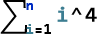
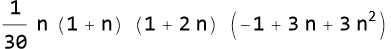
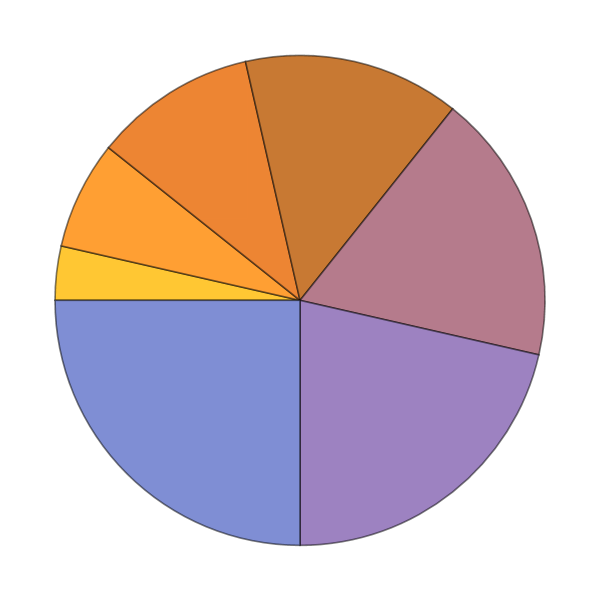
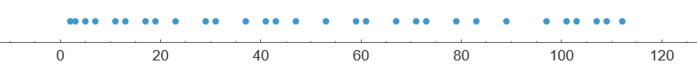
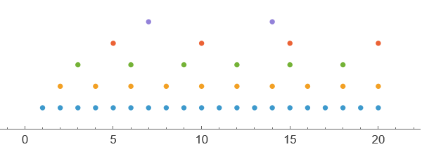

```wl
In[]:= {1, 2}~Join~{5, 6}
```

```wl
Out[]= {1, 2, 5, 6}
```

```wl
In[]:= Total[{1, 2, 5, 6}]
```

```wl
Out[]= 14
```





```wl
In[]:= PieChart@Range[7]
```



```wl
In[]:= NumberLinePlot[Prime[Range[30]]]
```



```wl
In[]:= NumberLinePlot[{Range[20], 2 Range[10], 3 Range[6], 5 Range[4], 7 Range[2]}]
```

