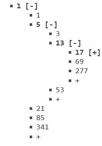

# playmath

a boy's math playground; math experiment

Cody Luo(cody@ustc.edu)

[https://github.com/a-boy/playmath](https://github.com/a-boy/playmath)  
[https://nbviewer.jupyter.org/github/a-boy/playmath/tree/master/](https://nbviewer.jupyter.org/github/a-boy/playmath/tree/master/)  

## Records:

- <b style="color:#0F0"> :star: 2019-09-02, I proved Goldbach's Conjecture!
  [stage12-try to prove Goldbach Conjecture.ipynb](https://github.com/a-boy/playmath/blob/master/stage12-Goldbach%20Conjecture/stage12-try%20to%20prove%20Goldbach%20Conjecture.ipynb)  
  _Note: in Sagemath env to run the codes_
  
  **Goldbach Conjecture Inequality 1**: **`gold(n) < prime_pi(n)+sigma(n,0)`**  
  gold(n): the min non-negative integer `g` makes that both `n-g` and `n+g` are primes  
  prime_pi(n): the count of primes in 1..n  
  sigma(n,0): the count of n.divisors()  
  `gold(n) < prime_pi(n), while n>344`  
  `gold(n) < prime_pi(n)*4395/3449751 ≈ prime_pi(n)*0.0013, while n>6*10^7`  
  
  **Goldbach Conjecture Inequality 2**: **`gold(n) < prime_pi(prime_pi(n)+n)`**

- :star: **2019-10-28, I solved 3n+1 Problem**!  
  [https://a-boy.tk/playmath/stage26-3n%2B1conjecture/proving-3n%2B1-conjecture.html](https://a-boy.tk/playmath/stage26-3n%2B1conjecture/proving-3n%2B1-conjecture.html) 

```
# Syracuse function g(n)
def g(n):
    while n%2==0 : n/=2
    n=3*n+1
    while n%2==0 : n/=2
    return n
```


Collatz-Odd-Tree1.png

 **Collatz-Odd-Tree Generating Rule**

1. `x` is a leaf node in the full Collatz-Odd-Tree iff `x%3==0`
2. `v(x)= x%3==1? (4*x-1)/3 : (2*x-1)/3` to generate the first child of `x` if `x%3!=0`
3. `h(x)=4*x+1` to generate the next sibling of `x`. Because `3(4*x+1)+1 = 12*x+4 = 4*(3*x+1)`

To prove 3n+1 Conjecture only needs to prove Collatz-Odd-Tree generating all positive odd integers.
Obviously, starting from `x0=1`, `h(x)=4*x+1` and `v(x)=(2*x-1)/3 or (4*x-1)/3` will iterate all positive integers formed of 4k+1 or 4k-1, just all positive odd integers. Collatz Conjecture is proved!□

- **:star: 2018-03-06, I proved Twin Primes Conjecture** and found a general law:

**Prime-Gap-Subsegments-Theorem**: In prime gap sequence, if a prime gap subsegment occurs twice, then it will continue to occur infinitely times.  such as `{2}, {4},{2*k},{2,4,2},{6,6},{2,6,4,2}...`

 [stage9-Prime gap subsegment if repeats twice then infinitely times.nb](stage9-Prime%20gap%20subsequence%20if%20repeats%20twice%20then%20infinitely%20times.nb)


- <b style="color:#0F0"> :star: 2010-02-04, I discovered Prime-Gap-Inequality: The i-th prime gap `p[i+1]-p[i]<=i` </b> In other words, `next_prime(n)-n <= primepi(n)`. This is because you can dispatch distinct prime factors for {p[i],p[i]+1,...,p[i+1]-1}.  
Corollary: The i-th prime `p[i]<=1+2+...+ i-1 + p[1] = i*(i-1)/2 +2`.
  
  Historical Prime Factor

- <b style="color:#0F0"> :star: I discovered Bread Curve and Bread Model by chance in 2011: </b>

```
def r(theta):= nest(sin,theta,1000)
polar_plot(r(theta),(theta,0,2*PI))

```


- before2011/果中的泪滴.png  
  

- <b style="color:#0F0"> :star: 2022-02-07, I improved Oppermann's Conjecture!</b>

NextPrime-Of-Square-Inequality: `next_prime(n^2) - n^2 <= 1+euler_phi(n)`

-:star: 2023-08-10,I proposed [**Plum Conjecture**](stage7-Mersenne-Prime/Plum-Conjecture.ipynb): when `n>1` and `0<b<sqrt(n)-1`, `2^(n^2±b)-1` is always composite. This is to say, the index `p` of a Mersenne prime `2^p-1` is NOT too close to some perfect square number.

https://math.stackexchange.com/questions/4750543

  
## idea:(mailto:a_boy@live.com)

- Goldbach-Triangle: every item is the average of top and right primes.

|   |   |   |   |   |   |   |   |   |   |   |
|---|---|---|---|---|---|---|---|---|---|---|
|3|
|4|  5|
|5|  6|  7|
|7|  8|  9|  11|
|8|  9|  10| 12| 13|
|10| 11| 12| 14| 15| 17|
|11| 12| 13| 15| 16| 18| 19|
|13| 14| 15| 17| 18| 20| 21| 23|
|16| 17| 18| 20| 21| 23| 24| 26| 29|
|17| 18| 19| 21| 22| 24| 25| 27| 30| 31|
|20| 21| 22| 24| 25| 27| 28| 30| 33| 34| 37|


- n>=3, let `p=nextprime(n!)-n!` , then p is always prime or 1, because p is less than ` nextprime(n)^2` , very often ` p<n^2 ` .

- denote S(k,v):=RamseyNumber(k+1,v+1)-1 . 
Conjecture: for any integer v>=2, S(2,v)%5 in {0,2,3}, here S(2,v)=RamseyNumber(3,v+1)-1 . That is to say,
RamseyNumber(3,v+1) can NOT be the form 5*k or 5*k+2

```
m	n	R(m,n)	Reference
3	3	6	Greenwood and Gleason 1955
3	4	9	Greenwood and Gleason 1955
3	5	14	Greenwood and Gleason 1955
3	6	18	Graver and Yackel 1968
3	7	23	Kalbfleisch 1966
3	8	28	McKay and Min 1992
3	9	36	Grinstead and Roberts 1982
3	10	[40, 43]	Exoo 1989c, Radziszowski and Kreher 1988
3	11	[46, 51]	Radziszowski and Kreher 1988
3	12	[52, 59]	Exoo 1993, Radziszowski and Kreher 1988, Exoo 1998, Lesser 2001
3	13	[59, 69]	Piwakowski 1996, Radziszowski and Kreher 1988

5	5	[43, 49]	Exoo 1989b, McKay and Radziszowski 1995
6	6	[102, 165]	Kalbfleisch 1965, Mackey 1994
7	7	[205, 540]	Hill and Irving 1982, Giraud 1973
```

Guess: for any ineteger n>=1, RamseyNumber(n+1,n+1)-1 = S(n,n) contains only the factors of Fermat Numbers ` F[m]=2^2^m+1 `, {1,2,3,5,17,257,641,65537,...}
S(2,2)=5, S(3,3)=17, I guess S(4,4)=45

- try to prove Twin Prime Conjecture

```
    1. Method 1: If a prime gap subsegment repeats twice, then it will occur infinitely times. 
    such as {2}, {4},{2*k},{2,4,2},{6,6}...
    1. Method 2: by using modern database function `groupby` on prime gap sequence, ...  
     Observing prime gap frequency distribution for primes up to some big integer N0 .  
     Peaks occur at multiples of 6. And the ratio of {2}s to {6}s will be great than a const(0.5 ?).
    1, 2, 2, 4, 2, 4, 2, 4, 6, 2, 6, 4, 2, 4, 6, 6, 2, 6, 4, 2, 6, 4, 6, 8, 4, 2, 4, 2, 4, 14, 4, 6, 2, 10, 2, 6, 6, 4, 6, 6, 2, 10, 2, 4, 2, 12, 12, 4, 2, 4, 6, 2, 10, 6, 6, 6, 2, 6, 4, 2, ... (sequence A001223 in the OEIS).
```

- define the integer sequence `x[n+1]:=x[n]^2+1`, if take x[0]>1, then  x[5] is very often composite.

- 定义:二密分解 `n=q1*q2` , `q1`取小于或等于`√n`的最大因数, `q2`取大于或等于`√n`的最小因数。
  是否值得尝试，使用二密分解或p-密分解的一些性质证明费马大定理? 

- OPPC(Odd Primes Position Constant) 奇质位常数，`2*k-1`如果是质数则二进制小数点后第k位为1，否则为0

```
const OPPC = .0111 0110 1101 0011
               1357 9
```

- 可能将圆周率Pi的二进制值分段，形成一个有规律的数组吗？如果可以的话，计算Pi的值就存在与之对应的极速算法。

```
  1   2   4    135     60753
  1|1.0|0100|10000111|1110110101010001|00010000101101000110000100011010011000100110001100110001010001011100000001101110000011100110100010010100100000010010011100000100010001010011001111100110001110100000000100000101110111110101001100011101100010011100110110010001001
```

## Question

- Ultra-Primes-Conjecture

```
There exists infinitely many primes formed of 2^(F[n!+1])-1 . here 2^p-1 is Mersenne number, F[n+2]=F[n+1]+F[n], 0,1,1,2,3,5,8,... is Fibonacci number, n! is factorial.

https://math.stackexchange.com/questions/3503947

2^F[2!+1]-1 = 3, 2^F[3!+1]-1= 2^13-1= 8191 are two known Ultra-Primes! I guess after 3, 8191 there are more prime heros!
```

- Inertia Law and Polar Method for integer sequences.  整数数列的惯性定理和极性定理

#### math tools

- Mathematica : .nb is Mathematica notebook
- Sagemath : .ipynb is Jupyter notebook, most of *.ipynb files in a-boy/playmath are used Sagemath, to view by Jupyter nbviewer, but to run codes only in Sagemath env; .sagews is Sagemath worksheet
- Maple
- GeoGebra
- Octave
- MathType
- Manim

#### 赞助支持


感谢你的赞助和支持，希望我们每天都能做得更好！！！

